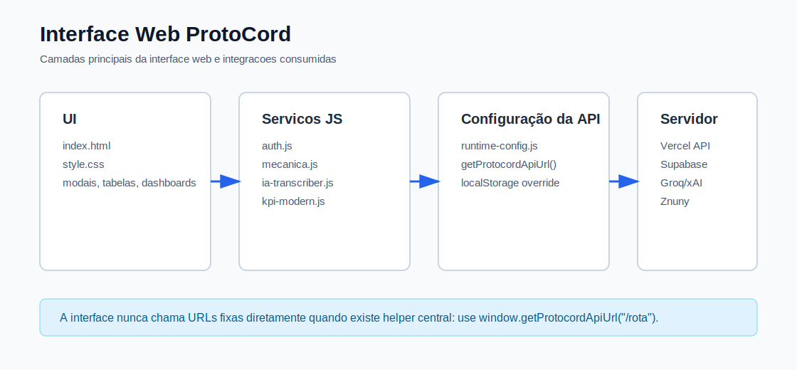
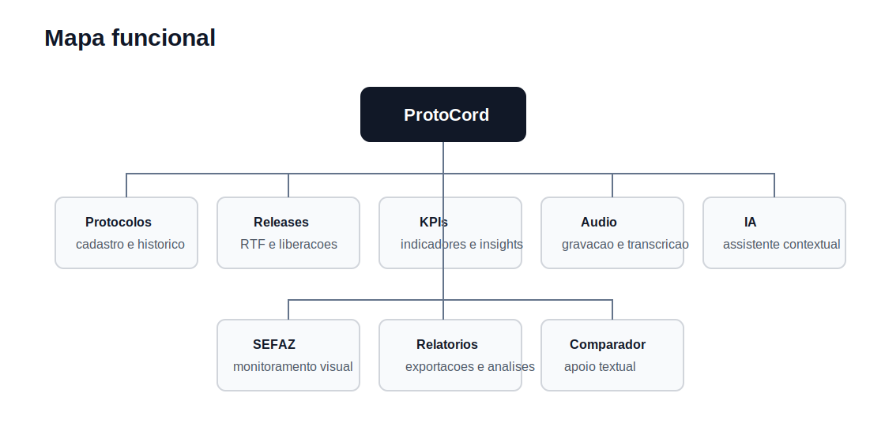

# ProtoCord - Interface Web

Interface web do ProtoCord, destinada ao apoio operacional de analistas de suporte na criação de protocolos, consulta de histórico, verificação de liberações, transcrição de áudios de atendimento e uso de assistente com inteligência artificial.



## 1. Finalidade

O projeto entrega uma aplicação estática, executada no navegador, que consome a API do projeto `modelo-discord-server`. A interface não armazena informações sensíveis nem acessa serviços externos diretamente. Todo acesso a banco de dados, provedores de inteligência artificial, arquivos temporários e sistemas integrados ocorre por meio do servidor.

## 2. Funcionalidades

- Registro de protocolos com PRT, ticket, módulo, descrição, paliativo e ligação de referência.
- Consulta, filtragem, ordenação e paginação do histórico de protocolos.
- Painéis de acompanhamento de liberações e indicadores operacionais.
- Transcrição e tratamento de áudios de atendimento.
- Assistente com inteligência artificial, integrado ao servidor, para respostas baseadas em contexto real.
- Comparador de textos em `html/comparador-textos.html`.
- Autenticação simples por senha validada no servidor.
- Configuração da URL da API em tempo de execução, sem necessidade de recompilar o projeto.



## 3. Tecnologias Utilizadas

- HTML, CSS e JavaScript.
- Tailwind CSS carregado por CDN.
- Chart.js, ApexCharts, SheetJS, Lucide, Animate.css e bibliotecas auxiliares carregadas conforme necessidade.
- Testes automatizados com `node:test`.

## 4. Estrutura De Pastas

```text
modelo-discord/
├─ index.html                  # Página principal da aplicação
├─ style.css                   # Estilos globais
├─ html/
│  └─ comparador-textos.html   # Ferramenta auxiliar de comparação textual
├─ js/
│  ├─ runtime-config.js        # Configuração central da API
│  ├─ auth.js                  # Autenticação, sessão e encerramento de sessão
│  ├─ mecanica.js              # Fluxo principal de protocolos
│  ├─ ia-transcriber.js        # Gravação, envio e transcrição de áudio
│  ├─ ia-assistant*.js         # Assistente com inteligência artificial
│  ├─ kpi-modern.js            # Indicadores e percepções operacionais
│  ├─ dashboard-liberacoes.js  # Painel de liberações por versão e módulo
│  └─ ...
└─ tests/                      # Testes automatizados
```

## 5. Pré-Requisitos

- Node.js 20 ou superior para execução dos testes.
- Servidor estático local, como `npx serve`, Live Server ou `python -m http.server`.
- Servidor do ProtoCord publicado ou executando localmente.

## 6. Instalação

```bash
npm install
```

## 7. Configuração Da API

O arquivo `js/runtime-config.js` concentra a resolução da URL da API. O valor padrão é:

```text
https://modelo-discord-server.vercel.app/api
```

Para usar outro servidor, injete a configuração antes dos demais scripts:

```html
<script>
  window.PROTOCORD_RUNTIME_CONFIG = {
    API_BASE_URL: "http://localhost:3000/api"
  };
</script>
```

Também é possível configurar pelo console do navegador:

```js
localStorage.setItem("PROTOCORD_API_BASE_URL", "http://localhost:3000/api");
location.reload();
```

## 8. Execução

Com `serve`:

```bash
npx serve . -l 5500
```

Acesse:

```text
http://localhost:5500
```

Com Python:

```bash
python -m http.server 5500
```

## 9. Testes

```bash
npm test
```

Os testes validam configuração em tempo de execução, autenticação, fluxo de transcrição, interface de processamento e componentes de indicadores.

## 10. Rotas Consumidas

| Uso | Rota |
| --- | --- |
| Saúde do servidor | `GET /api/health` |
| Autenticação | `GET /api/autenticacao?pass=<md5>` |
| Protocolos | `GET/POST/DELETE /api/protocolos` |
| Módulos | `GET /api/modulos` |
| Liberações | `GET/POST /api/liberados` |
| Notificações | `GET /api/notificacao` |
| Limpeza de notificações | `GET /api/limpar_notificacao` |
| Envio de áudio | `POST /api/blob-upload` |
| Transcrição estruturada | `POST /api/transcrever` |
| Transcrição direta | `POST /api/transcricao-direta` |
| Assistente | `GET/POST /api/assistente` |

## 11. Variáveis De Configuração

| Nome | Local | Finalidade |
| --- | --- | --- |
| `PROTOCORD_RUNTIME_CONFIG.API_BASE_URL` | Navegador | URL base configurada antes da carga da aplicação. |
| `PROTOCORD_API_BASE_URL` | Navegador | URL base resolvida para chamadas HTTP. |
| `PROTOCORD_API_SERVER_ORIGIN` | Navegador | Origem do servidor sem o sufixo `/api`. |
| `PROTOCORD_TRANSCRIBER_API` | Navegador | Compatibilidade com fluxos anteriores de transcrição. |

## 12. Observações De Manutenção

- Novos recursos devem usar `window.getProtocordApiUrl("/rota")`.
- Segredos, chaves e credenciais nunca devem ser colocados no código da interface.
- Dados técnicos retornados pela API devem ser convertidos para linguagem operacional antes de serem exibidos ao usuário.
- Em alterações de servidor durante testes, limpe `PROTOCORD_API_BASE_URL` no `localStorage`, se necessário.

## 13. Documentação Técnica

Consulte [docs/DOCUMENTACAO_TECNICA.md](docs/DOCUMENTACAO_TECNICA.md) para detalhes de módulos, escopos, variáveis, fluxo de dados e relação com o servidor. Também há uma versão consolidada em PDF: [docs/DOCUMENTACAO_TECNICA_PROTOCORD.pdf](docs/DOCUMENTACAO_TECNICA_PROTOCORD.pdf).
